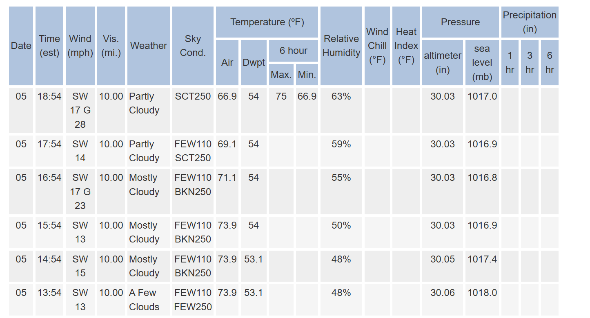
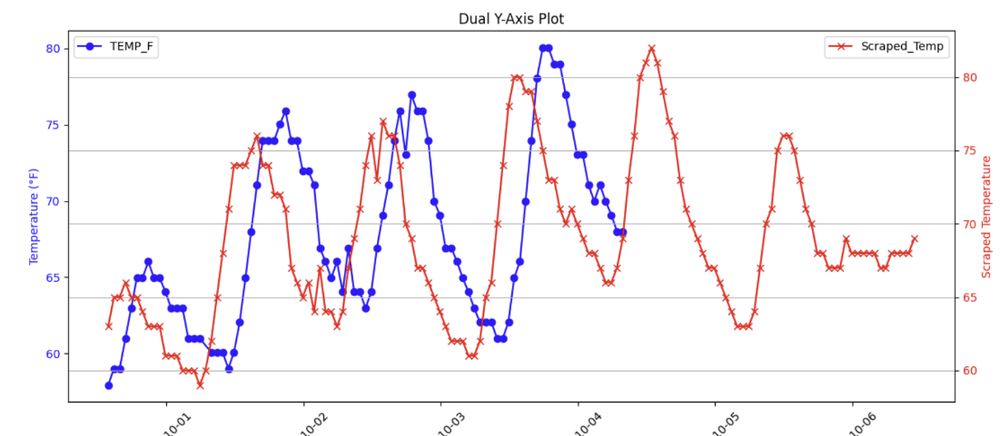

## How to Reproduce

1. **Install dependencies**:  
   Run the following command to install all required dependencies:  
   ```bash
   make install
      
2. **Run the best result**:  
   After installing dependencies, execute the following to reproduce our best-performing results:  
   ```bash
   python reslutLSTM.py

  
# Weather Data Analysis

To begin, we explored various data sources including NOAA, Weather Underground, OpenWeatherMap, WeatherAPI, TimeAndDate, and Kaggle. We encountered two primary challenges in this phase:

1. **Data Source Accessibility:** Some of the chosen websites were not entirely free or offered limited data access without a subscription. This posed a constraint on data availability for the project.

2. **Data Structure Ambiguity:** Upon securing access to data through API calls, another hurdle emerged—the structure of the JSON files. Understanding the structure and meaning of certain columns was not straightforward, necessitating a substantial amount of time to decipher the data.

## Data Collection Approaches

To overcome these challenges, we used a combination of data collection methods:

1. **Direct Data Download:** In one instance, we directly downloaded a dataset from Kaggle. While this source provided a structured dataset, it still required preprocessing to meet project requirements.

2. **Web Scraping: (See data_collection.py)** Additionally, we resorted to web scraping to extract data from NOAA. This required parsing and structuring the data for further analysis. We setup a github workflow to scrape the weather data from NOAA at 4 am everyday.
Below are the head of the data from NOAA


## Preliminary Visualizations of Data

Initially, we have trained an ARIMA model using temperature from October only, and the following are the time vs temp plot of the data. As arima only takes temperature as input, we only created this visualization at this point.

Additionally, we have downloaded historical weather data.

## Detailed Description of Data Processing

The data processing was done to the historical data mainly and we will include it into our future model. The figure below shows that there is a time lag between the historical temperature and the scraped ground truth, and this data is fixed in data comparison between scraped data and historical data. We shifted the time axis on the historical data to match the ground truth.


Also, there are some anomalies in the raw historical data. For example, a temperature of 99999. If the gap between two correct records is short, we simply use the average to fill the gap, but if the gap is large, we then choose to use autoregressive modeling to fill the blank.

## Data Modeling Methods Used So Far (See arima.py)

We started with autoregressive modeling, specifically focusing on the AutoRegressive Integrated Moving Average (ARIMA) model. ARIMA is widely employed in short-term temperature prediction due to its ability to capture autocorrelation, trends, seasonality, and short-term fluctuations in time series data.

We began with stationarity assessment, and the autocorrelation and partial autocorrelation figures are shown below.


### Plots Analysis

The generated plots provided critical insights into the dataset's characteristics:

- **ACF Plot:** The autocorrelation function (ACF) plot exhibited a gradual tailing-off pattern, suggesting the potential benefit of incorporating a moving average (MA) term in the model.

- **PACF Plot:** Conversely, the partial autocorrelation function (PACF) plot displayed a sharp cut-off after approximately 2 lags. This indicated that an autoregressive (AR) term of around 2 might be suitable.

Based on this initial analysis, we selected the starting ARIMA model as ARIMA(2,0,1).

**Results:**

The results of this initial implementation demonstrated a close fit to the temperature trend over the forecasted period. However, a closer examination raised concerns. The predicted temperatures formed an almost straight-line pattern, raising doubts about the model's ability to hold up in other instances and scenarios.

### ARIMA Model Parameters: AR, I, MA

In the context of the ARIMA model, the selection of its parameters—AutoRegressive (AR), Integrated (I), and Moving Average (MA)—plays a pivotal role in the model's performance and predictive capabilities. We considered these parameters in-depth during our modeling process:

- **AR (AutoRegressive):** The AR parameter represents the relationship between an observation and a number of lagged observations, specifically, the previous time points. For this project, where we aimed to generate temperature predictions for 24 hours ahead, we anticipated a higher value for the AR parameter. A larger AR value would enable the model to incorporate more historical data into its predictions, capturing potential patterns and dependencies over a longer period.

- **I (Integrated):** The Integrated parameter addresses non-stationarity in the data. Given that the ADF test results confirmed the dataset's stationarity, we placed less emphasis on this parameter in our modeling approach. The stationary nature of the data reduced the need for differencing operations to achieve stationarity.

- **MA (Moving Average):** The MA parameter accounts for the relationship between an observation and a residual error from a moving average model applied to lagged observations. Our inclination was to increase the MA value in our ARIMA model. This decision was driven by the primary concern of potentially missing complex patterns in the data. By incorporating a higher MA value, the model could better capture and account for variations and fluctuations in the temperature data.

---

In our pursuit of optimizing the ARIMA model for temperature prediction, we decided to conduct a systematic exploration of various model orders. Specifically, we varied the parameters p (AR) and q (MA) within the range of 6 to assess their impact on the model's performance.

### Model Order Iteration

We initiated a programmatic iteration over a range of p and q values, ranging from 0 to 6. The aim was to identify the optimal combination of these parameters within an order range of (6, 0, 6).


## Results of ARIMA

Below are some figures of current prediction


As we can see from the last plot on Oct 24, it is evident that the model's predictions closely align with the ground truth data. This alignment suggests the model's effectiveness in capturing and forecasting temperature trends during that day. However, if we examine on other plot from Oct 21, 22 and 23, the success did not persist. The prediction on these days,  while still following the general trend, deviated significantly from the actual values. Furthermore, discrepancies between the predicted and actual temperature values persisted in the following data points. It is apparent that the ground truth data exhibited greater variability during these days, indicating that rapid temperature changes occurred. These patterns were not adequately captured by the ARIMA model.

## LSTM Model

As ARIMA is a relatively simple model that relies primarily on past values of the target variable and often assumes linearity and stationarity, it may fall short in capturing the underlying trends and patterns driven by a range of interdependent factors beyond temperature itself. In contrast, we turned to Long Short-Term Memory (LSTM) networks, a specialized type of Recurrent Neural Network (RNN) designed to overcome some of the fundamental limitations of traditional time-series models. LSTMs employ a series of gating mechanisms—input, forget, and output gates—that allow them to selectively remember or discard information over extended sequences. This architectural feature is particularly valuable in the context of weather prediction, where conditions such as humidity, dew point, seasonal cycles, and diurnal variations interact in complex, non-linear ways over varying timescales. By effectively managing these long-term dependencies, the LSTM can learn intricate temporal relationships that simpler models like ARIMA would likely miss. In other words, while ARIMA looks backward a limited number of steps and can struggle when the data shifts or evolves, an LSTM can adapt its internal state to evolving patterns, incorporate multiple concurrent inputs, and maintain a nuanced representation of the data’s history—enabling it to produce more accurate and robust forecasts.

## Feature Selection (see featureSelection.py)

We employed a systematic feature selection approach to identify the most predictive variables for forecasting maximum temperature over the next 24 hours. First, we conducted correlation analysis and visualized how each feature related to the target, removing those with negligible or redundant associations. We then used mutual information (MI) to capture non-linear dependencies between features and the target, providing additional insights into their predictive power. Next, we leveraged a tree-based model, specifically a Random Forest Regressor, to determine the relative importance of different predictors, allowing us to prioritize those that contributed most to reducing prediction errors. Finally, we applied Recursive Feature Elimination (RFE) with a linear model to iteratively refine our feature set, systematically removing the least important variables until we arrived at a subset that balanced model simplicity with accuracy. Based on these combined insights, we selected a comprehensive set of features that included raw measures (e.g., Temperature, Relative Humidity, Dew Point), time-derived cyclical transformations (e.g., Date_Sin, Date_Cos, Month_Sin, Month_Cos, Hour_Sin, Hour_Cos), and a sequence of lagged temperature values from the past 24 hours. This careful feature engineering and selection process ensured that our final model input retained the most informative predictors, thereby improving the overall forecasting performance.


From all the plots and analyses, it becomes evident that while additional features—such as humidity, dew point, and various time-derived cyclical transformations—do contribute to the prediction, the influence of the current temperature stands out as overwhelmingly dominant. This is reflected in both the correlation and mutual information measures, as well as the feature importance rankings from the tree-based models and RFE. The strong predictive power of temperature itself helps explain why a univariate ARIMA model, which relies solely on past temperature values, can still yield reasonably accurate forecasts. Although incorporating more features can provide incremental improvements, the robustness of temperature alone as a predictor underscores its pivotal role in shaping accurate temperature forecasts.

## LSTM Hyperparameter Tuning (see HyperParaAutoTun.py)

To identify the optimal hyperparameters for our LSTM model, we utilized [Optuna](https://optuna.org/), a flexible and efficient hyperparameter optimization library. By systematically searching through a parameter space that included:

- **Sequence Length** (in increments of one hour)
- **Batch Size**
- **Hidden Layer Size**
- **Number of LSTM Layers**
- **Learning Rate**

and incorporating early stopping to prevent overfitting, Optuna discovered the best-performing configuration: {"sequence_length": 14, "batch_size": 32, "hidden_size": 121, "num_layers": 3, "lr": 0.0002930386152314192}

Counterintuitively, we observed that increasing sequence length tended to raise, rather than reduce, the RMSE. 


We hypothesize that while a longer input sequence should, in theory, help the model capture more extended patterns and seasonalities, the dataset at hand may not provide sufficient long-term data to reap these benefits. To test this hypothesis, we extended our dataset to include the past five years of data. With this extended period, the model’s performance initially worsened as sequence length grew, but eventually improved once the sequence length surpassed the seasonal cycle of approximately 365 days. This finding suggests that data quantity and coverage of seasonal patterns are critical considerations when tuning sequence length for LSTM models.


## Results and Analysis (resultLSTM.py)

We evaluated our model’s ability to predict the maximum temperature over the next 24 hours. To do this, we set aside a test set of 1000 consecutive hours of data from November. As illustrated in the figure below, the LSTM predictions generally track the trend of the actual observed temperatures, although there is still room for improvement. In this test scenario, our model achieved an RMSE of approximately 6.19 ºF. While not highly accurate, this performance is relatively promising, especially considering that the model relies on only 14 hours of past data to forecast the next day’s peak temperature.

Notably, when compared to an ARIMA model, the LSTM achieved similar accuracy levels with far less input data. This indicates the efficiency of the LSTM approach, suggesting that neural network-based models can capture essential patterns in fewer input sequences, potentially streamlining the forecasting process.


## future work

One major limitation of our current approach is the depth of our domain understanding. Since none of the team members has expertise in meteorology or environmental science, our ability to select and engineer features was constrained. With greater domain knowledge, we could refine the selection of weather-related variables—such as humidity, wind speed, or solar radiation—and create more meaningful transformations of these features. Such domain-driven feature engineering would likely lead to better model performance.

Furthermore, our analysis during hyperparameter tuning revealed that model accuracy continued to improve beyond the first year of historical data. This suggests that adding more extensive historical datasets could help the model uncover longer-term seasonal and climatic trends, thus enhancing predictive accuracy. Future work would involve gathering and integrating larger, more comprehensive datasets to capitalize on this observation and further improve forecasting results.

## test workflow

We introduced a simple test workflow to verify imported libraries and datasets.


